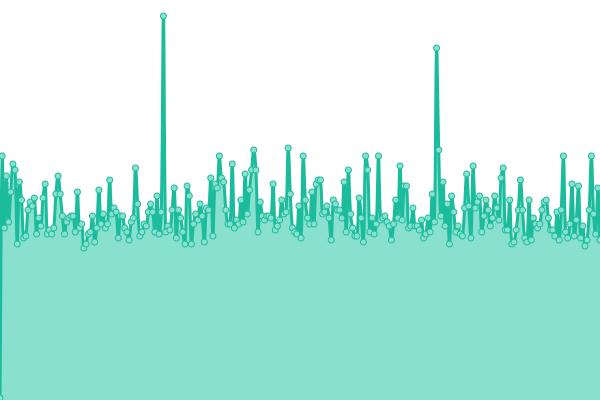
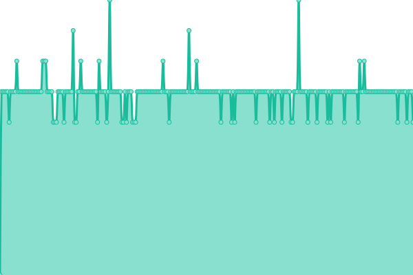
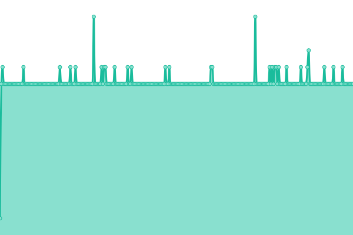
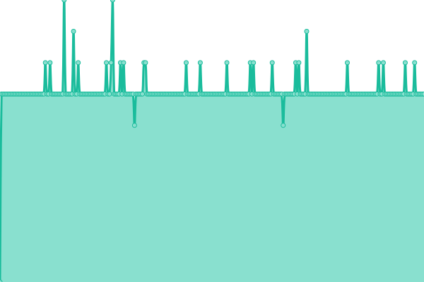
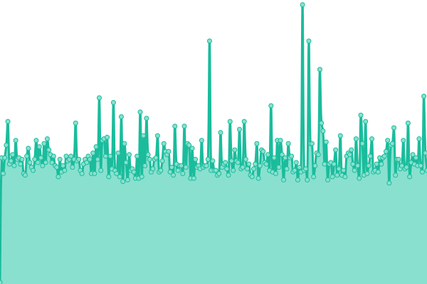
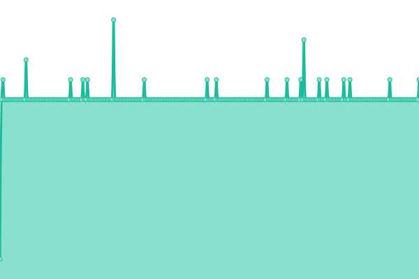
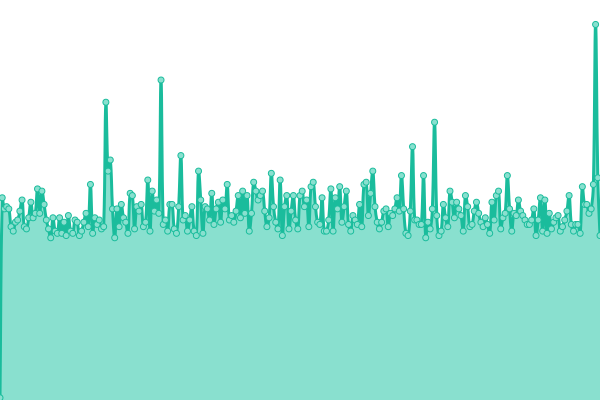
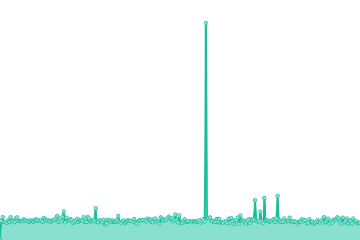
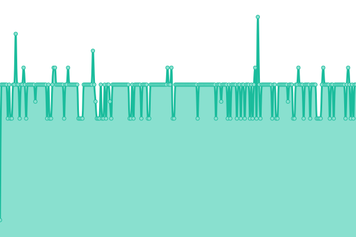

# [📈 Live Status](https://UK-DNS-Privacy-Project.github.io/status): <!--live status--> **🟩 All systems operational**

This repository contains the open-source uptime monitor and status page for [UK DNS Privacy Project](https://UK-DNS-Privacy-Project.github.io/status), powered by [Upptime](https://github.com/upptime/upptime).

With [Upptime](https://upptime.js.org), you can get your own unlimited and free uptime monitor and status page, powered entirely by a GitHub repository. We use [Issues](https://github.com/UK-DNS-Privacy-Project/status/issues) as incident reports, [Actions](https://github.com/UK-DNS-Privacy-Project/status/actions) as uptime monitors, and [Pages](https://UK-DNS-Privacy-Project.github.io/status) for the status page.

<!--start: status pages-->
<!-- This summary is generated by Upptime (https://github.com/upptime/upptime) -->
<!-- Do not edit this manually, your changes will be overwritten -->
<!-- prettier-ignore -->
| URL | Status | History | Response Time | Uptime |
| --- | ------ | ------- | ------------- | ------ |
|  [website](https://dnsprivacy.org.uk/) | 🟩 Up | [website.yml](https://github.com/UK-DNS-Privacy-Project/status/commits/HEAD/history/website.yml) | 

 95ms
     
 | 

<a href="https://UK-DNS-Privacy-Project.github.io/status/history/website">100.00%</a>
    

|  [ns1.dnsprivacy.org.uk](ns1.dnsprivacy.org.uk) | 🟩 Up | [ns1-dnsprivacy-org-uk.yml](https://github.com/UK-DNS-Privacy-Project/status/commits/HEAD/history/ns1-dnsprivacy-org-uk.yml) | 

 7ms
     
 | 

<a href="https://UK-DNS-Privacy-Project.github.io/status/history/ns1-dnsprivacy-org-uk">100.00%</a>
    

|  [ns2.dnsprivacy.org.uk](ns2.dnsprivacy.org.uk) | 🟩 Up | [ns2-dnsprivacy-org-uk.yml](https://github.com/UK-DNS-Privacy-Project/status/commits/HEAD/history/ns2-dnsprivacy-org-uk.yml) | 

 9ms
     
 | 

<a href="https://UK-DNS-Privacy-Project.github.io/status/history/ns2-dnsprivacy-org-uk">99.92%</a>
    

|  [resolver-1.dnsprivacy.org.uk (DNS)](resolver-1.dnsprivacy.org.uk) | 🟩 Up | [resolver-1-dnsprivacy-org-uk-dns.yml](https://github.com/UK-DNS-Privacy-Project/status/commits/HEAD/history/resolver-1-dnsprivacy-org-uk-dns.yml) | 

 7ms
     
 | 

<a href="https://UK-DNS-Privacy-Project.github.io/status/history/resolver-1-dnsprivacy-org-uk-dns">100.00%</a>
    

|  [resolver-1.dnsprivacy.org.uk (DoH)](https://resolver-1.dnsprivacy.org.uk/dns-query?dns=AAABAAABAAAAAAABCW5sbmV0bGFicwJubAAAHAABAAApEAAAAIAAAAA) | 🟩 Up | [resolver-1-dnsprivacy-org-uk-do-h.yml](https://github.com/UK-DNS-Privacy-Project/status/commits/HEAD/history/resolver-1-dnsprivacy-org-uk-do-h.yml) | 

 80ms
     
 | 

<a href="https://UK-DNS-Privacy-Project.github.io/status/history/resolver-1-dnsprivacy-org-uk-do-h">100.00%</a>
    

|  [resolver-1.dnsprivacy.org.uk (DoT)](resolver-1.dnsprivacy.org.uk) | 🟩 Up | [resolver-1-dnsprivacy-org-uk-do-t.yml](https://github.com/UK-DNS-Privacy-Project/status/commits/HEAD/history/resolver-1-dnsprivacy-org-uk-do-t.yml) | 

 7ms
     
 | 

<a href="https://UK-DNS-Privacy-Project.github.io/status/history/resolver-1-dnsprivacy-org-uk-do-t">100.00%</a>
    

|  [resolver-2.dnsprivacy.org.uk (DNS)](resolver-2.dnsprivacy.org.uk) | 🟩 Up | [resolver-2-dnsprivacy-org-uk-dns.yml](https://github.com/UK-DNS-Privacy-Project/status/commits/HEAD/history/resolver-2-dnsprivacy-org-uk-dns.yml) | 

 9ms
     
 | 

<a href="https://UK-DNS-Privacy-Project.github.io/status/history/resolver-2-dnsprivacy-org-uk-dns">99.92%</a>
    

|  [resolver-2.dnsprivacy.org.uk (DoH)](https://resolver-2.dnsprivacy.org.uk/dns-query?dns=AAABAAABAAAAAAABCW5sbmV0bGFicwJubAAAHAABAAApEAAAAIAAAAA) | 🟩 Up | [resolver-2-dnsprivacy-org-uk-do-h.yml](https://github.com/UK-DNS-Privacy-Project/status/commits/HEAD/history/resolver-2-dnsprivacy-org-uk-do-h.yml) | 

 85ms
     
 | 

<a href="https://UK-DNS-Privacy-Project.github.io/status/history/resolver-2-dnsprivacy-org-uk-do-h">99.92%</a>
    

|  [resolver-2.dnsprivacy.org.uk (DoT)](resolver-2.dnsprivacy.org.uk) | 🟩 Up | [resolver-2-dnsprivacy-org-uk-do-t.yml](https://github.com/UK-DNS-Privacy-Project/status/commits/HEAD/history/resolver-2-dnsprivacy-org-uk-do-t.yml) | 

 9ms
     
 | 

<a href="https://UK-DNS-Privacy-Project.github.io/status/history/resolver-2-dnsprivacy-org-uk-do-t">100.00%</a>
    

|  [resolver.dnsprivacy.org.uk (DNS)](resolver.dnsprivacy.org.uk) | 🟩 Up | [resolver-dnsprivacy-org-uk-dns.yml](https://github.com/UK-DNS-Privacy-Project/status/commits/HEAD/history/resolver-dnsprivacy-org-uk-dns.yml) | 

 9ms
     
 | 

<a href="https://UK-DNS-Privacy-Project.github.io/status/history/resolver-dnsprivacy-org-uk-dns">100.00%</a>
    

|  [resolver.dnsprivacy.org.uk (DoH)](https://resolver.dnsprivacy.org.uk/dns-query?dns=AAABAAABAAAAAAABCW5sbmV0bGFicwJubAAAHAABAAApEAAAAIAAAAA) | 🟩 Up | [resolver-dnsprivacy-org-uk-do-h.yml](https://github.com/UK-DNS-Privacy-Project/status/commits/HEAD/history/resolver-dnsprivacy-org-uk-do-h.yml) | 

 87ms
     
 | 

<a href="https://UK-DNS-Privacy-Project.github.io/status/history/resolver-dnsprivacy-org-uk-do-h">100.00%</a>
    

|  [resolver.dnsprivacy.org.uk (DoT)](resolver.dnsprivacy.org.uk) | 🟩 Up | [resolver-dnsprivacy-org-uk-do-t.yml](https://github.com/UK-DNS-Privacy-Project/status/commits/HEAD/history/resolver-dnsprivacy-org-uk-do-t.yml) | 

 9ms
     
 | 

<a href="https://UK-DNS-Privacy-Project.github.io/status/history/resolver-dnsprivacy-org-uk-do-t">100.00%</a>
    

<!--end: status pages-->

[**Visit our status website →**](https://UK-DNS-Privacy-Project.github.io/status)

## 📄 License

- Powered by: [Upptime](https://github.com/upptime/upptime)
- Code: [MIT](./LICENSE) © [Anand Chowdhary](https://anandchowdhary.com), supported by [Pabio](https://pabio.com)
- Data in the `./history` directory: [Open Database License](https://opendatacommons.org/licenses/odbl/1-0/)
